# Capstone: Web Traffic Time Series Forecasting

<!--
## Data is obtained from Kaggle competition: 
[Web Traffic Time Series](https://www.kaggle.com/competitions/web-traffic-time-series-forecasting/) -->

## Problem Identification Overview

How can the internet servers, such as Google, Facebook, and Yahoo, improve their capability in
handling traffic control by means of time series analysis, forecasting an accurate prediction of future
views for the next 60 days?

### Context

Web traffic can be defined as the number of visits to a website, including requests sent and received by web
users. We aim to predict future web traffic for approximately a total of 145k Wikipedia articles to make
better traffic control decisions. The increase in traffic for the websites could cause a lot of inconvenience
for the users by a crashed site or very slow loading time. Therefore, a traffic management technique or plan
should be put in place to reduce the risk of such problems.

## Recommendation

Given the time series data that contains 145k Wikipedia pages, we have built and evaluated three different
models using Seasonal AutoRegressive Integrated Moving Average (SARIMA), Prophet which was
developed and supported by Facebook, and Long Short-Term Memory (LSTM). We found that **the LSTM
model had the smallest error from the validation process, setting the last 60 days to the test dataset.
Therefore, we strongly recommend that internet servers make use of our LSTM model to predict the
traffic of web pages to avoid any mishaps such as server shutdown or slowdown.** Note that in this
analysis, we reduced the time series data into averaged daily traffic for the total pages without considering
the individual ones as it is not computationally infeasible if we take them into account.

## Data Analysis
Data is obtained from [Kaggle competition for Web Traffic Time Series](https://www.kaggle.com/competitions/web-traffic-time-series-forecasting/)

- train.csv
	- 145k rows each of which represents a different Wikipedia page
	- 804 columns: article title + daily traffic on the particular Wikipedia page from 2015-07-01 to
2017-09-10
	- The first column contains information about the page which includes the information of language, access, and agent.

In this time series dataset, there are two kinds of missing values. The first type is the case where the data
is actually missing, and the second type is the case where the page is not created at the specific time and
the page has the valid counts of visits only after the page is created. For the former case, we make use of
linear interpolation to the neighbor data, and for the latter case, we simply fill in the zero value. In Figure
1, the *52_Hz_I_Love_You_zh.wikipedia.org_all-access_spider* page is created in 2016 April, so we fill
zero value before it is created, which is shown as the red line.

   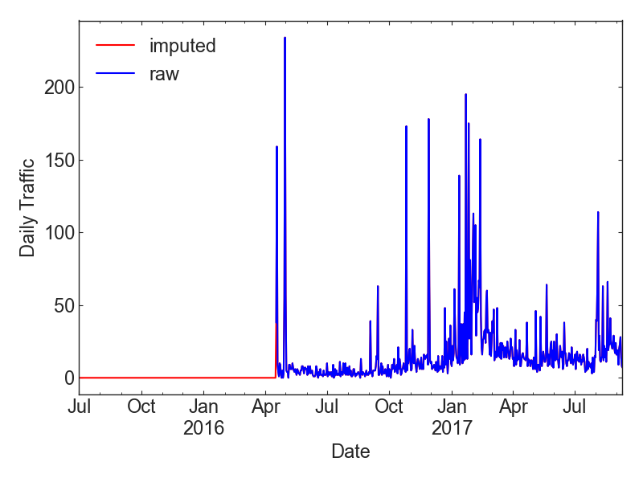
   
 <i> Figure 1. Imputed Data for '52_Hz_I_Love_You_zh.wikipedia.org_all-access_spider' Wikipedia page. The blue line represents the normal data, and the red line represents the imputed data.</i> 
   

### Number of Articles

The dataset consists of 145k Wiki pages with different languages. As seen in Figure 2, the number of
articles written in English is 24k, which is the largest among other languages. It is followed by Japanese,
Germany, and French wiki pages. Interestingly, the number of the Spanish wiki page is smallest although
Spanish is arguably ranked as the fourth most spoken language in the world, behind only English, Hindi,
and Mandarin Chinese. Wikimedia and Mediawiki are miscellaneous pages, which may contain supplementary materials. Since they have no language information in the title, they are classified as their
categorical title.

   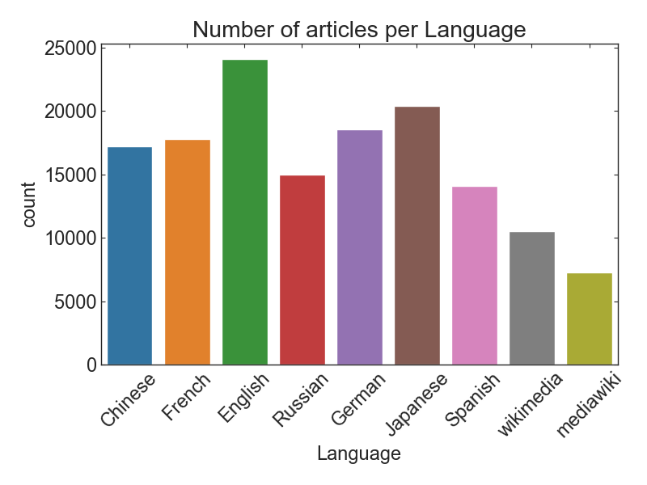
   <!-- <figcaption> <i> Figure 2. Number of articles per language.</i> </figcaption> -->
   
<i> Figure 2. Number of articles per language.</i>

In the left panel of Figure 3, we can infer the total number of agents for the wiki pages, which non-spider
agents are dominant over spider agents. This is not surprising as spider agent, known as web [crawler](https://en.wikipedia.org/wiki/Web_crawler), has
a limited purpose for web indexing. In the right panel of Figure 3, we can see that the number of mobileweb-
accessible wiki pages is slightly larger than that of desktop-accessible pages, although the difference
is not noticeable. These days, mobile tools are well-developed, and people live in a world where they can
search for the information that they need in any place by simply turning on a phone or tablet. However, for
this Wikipedia dataset, the desktop seems to be still equally important as an accessing tool.

   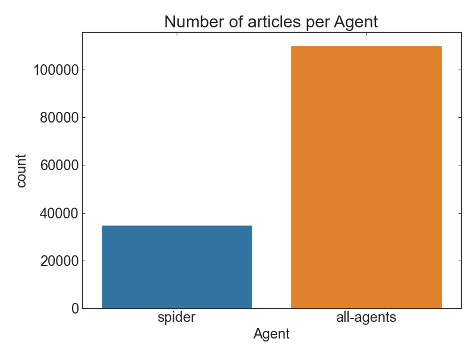
   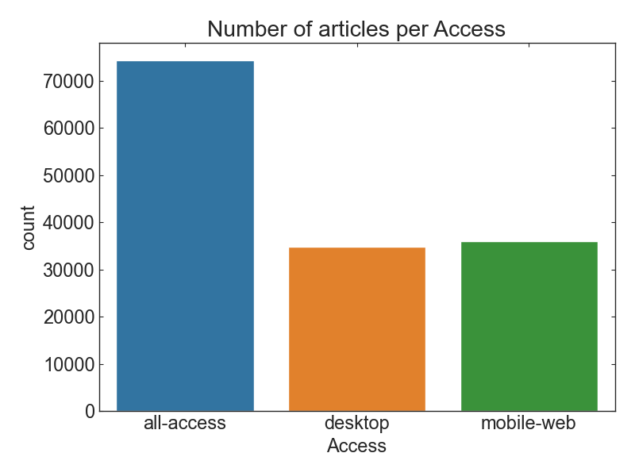
   
 <i> Figure 3. The number of articles per agent (left panel) and per access (right panel).</i>
   

### Daily Traffic

It is interesting to note that even though the number of articles for mobile-web access is slightly larger than
that for desktop, the trend of the daily traffic is the opposite. In Figure 4, the overall time series is similar
between the two accesses with desktop access being slightly higher. Interestingly, there are several spikes
that are associated only with pages from desktop access: the largest spike in August 2016 and other spikes
in September and October 2016.

   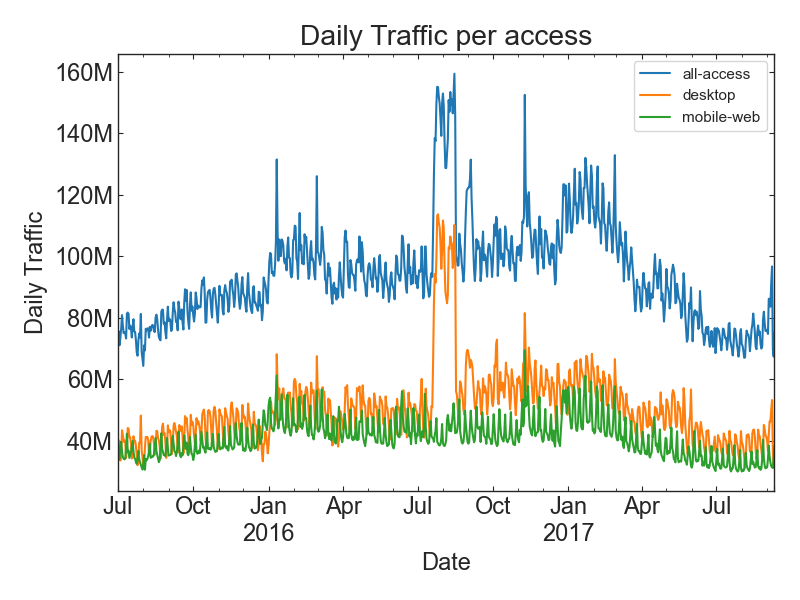
   
<i> Figure 4. Total daily traffic per access as a function of time</i>

   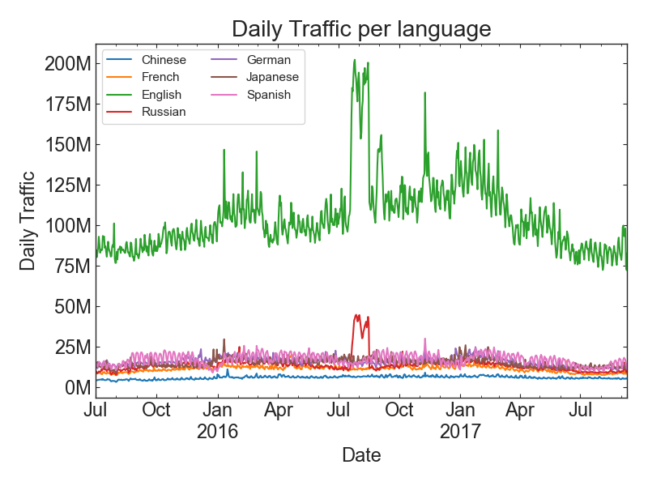
   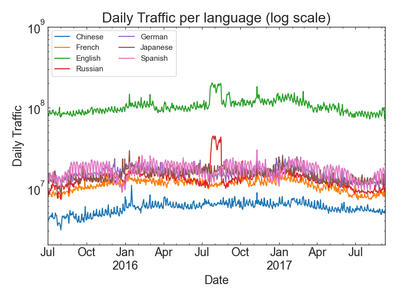
   
 <i> Figure 5. Total daily traffic per language in real scale (left panel) and in logarithmic scale (right panel).</i>
   

As seen in Figure 2, the wiki pages in the dataset are written in 7 languages: Chinese, French, English,
Russian, German, Japanese, and Spanish. Not surprisingly, the English wiki pages have an order of
magnitude larger daily traffic than the pages written in other languages (see Figure 5). One notable point is
that the trend of the daily traffic is similar between the English pages and the Russian pages, including the
large spike in August 2016. Otherwise, while the number of articles for the Spanish pages is the smallest,
their daily traffic (pink line) is the second largest, which possibly reflects the fact that Spanish is one of the
worldwide most spoken languages. On the contrary, the number of articles for the Chinese pages is quite
large, however, their daily traffic is the smallest. This is possibly due to the relatively strict internet
censorship in China, which makes people difficult in searching and access the pages.

### Average Visits

To get a deeper insight into the daily traffic, we explore the average visits of the wiki pages by several
conditions (see Figure 6). Firstly, we find that during the period in the dataset, people visited the Wiki
considerably in January and February, and fewer visited in June and July. Secondly, there is no significant
difference in the average views over weekdays while Monday and Sunday visits are slightly larger than
other weekdays. As a result, the result shows that holiday/weekend has less influence on the daily traffic.
Lastly, we note that the average view of the wiki pages is the largest in 2016. However, this may need a
careful approach as the time series data in 2015 and 2017 does not contain full-year data.

   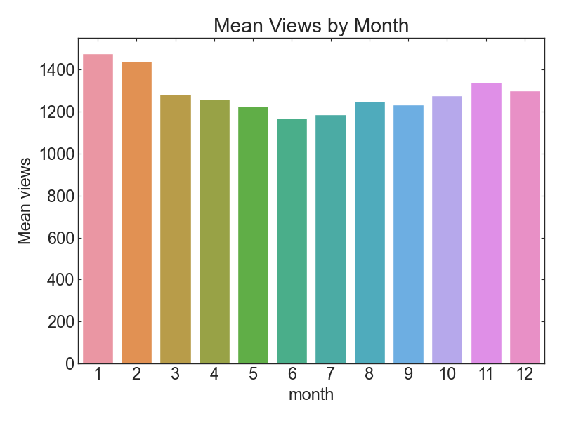
   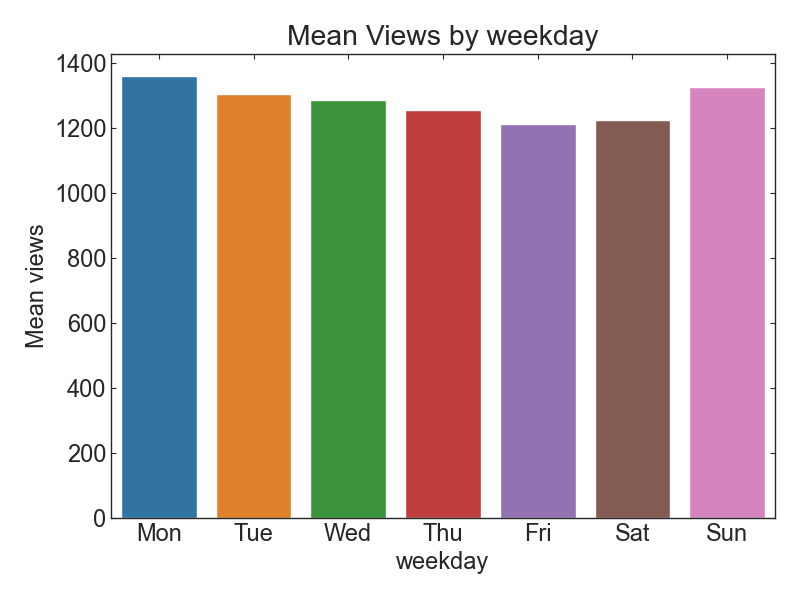  
   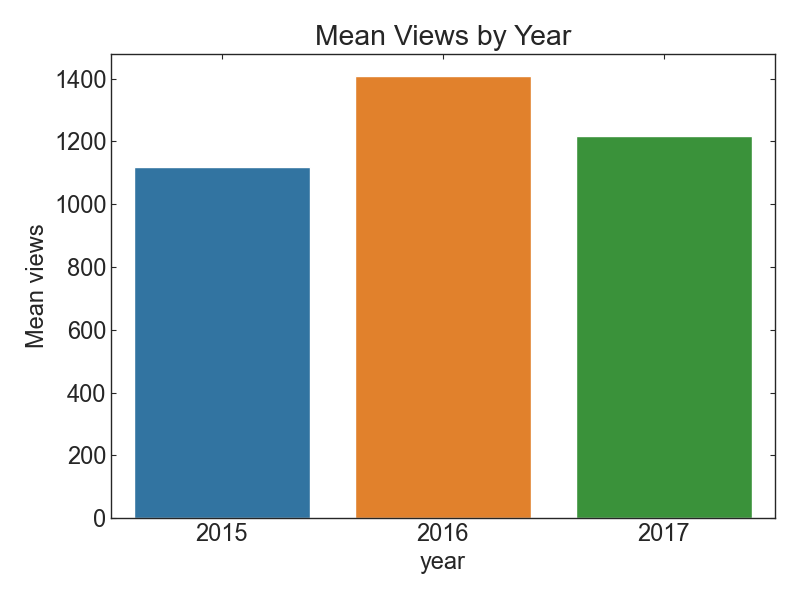
   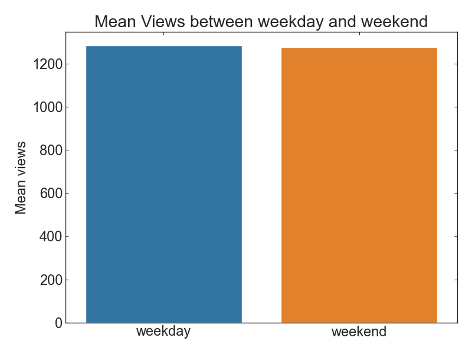
   
 <i> Figure 6. The averaged view of the total Wiki pages by month (upper left), weekdays (upper right), year (bottom left), and between weekday and weekend (bottom right).</i>
   

## Feature Engineering

The original time series dataset is in a wide format, where the columns are the sequence of time and the
rows are the individual articles. In order to perform machine learning effectively, we transform the data
format from wide to long. The long data format is beneficial for grouping the dataset by any features of
interest (see previous EDA sections).

For preparing the machine learning, we compute the average of daily traffic in the time series dataset. We
make use of this averaged time series without considering the impact of individual 145k pages. Due to the
limited computation resource, it is not feasible to handle a such tremendous number of articles individually.
However, we may be able to improve our model further in the future by considering the effects of subgrouped
articles (e.g., sub-grouped by languages).

In order to evaluate the models, we split the time series into train and test data. The test data is set to the
last 60 days' data. Once we forecast the values from each model using the train data, we will evaluate the
model by comparing the predicted values and the actual values from the test data.

## Modeling

Using the cleaned & reduced dataset, we build up a model with 3 different methods:
Seasonal AutoRegressive Integrated Moving Average (SARIMA), Prophet by Facebook, and Long Short-
Term Memory (LSTM).

### Seasonal AutoRegressive Integrated Moving Average (SARIMA)

AutoRegressive Integrated Moving Average (ARIMA) is one of the most widely used forecasting methods
for univariate time series data forecasting. An extension to ARIMA that supports the direct modeling of the
seasonal component of the series is called SARIMA. We build our first model with SARIMA and check
the stationarity of the dataset prior to the modeling.

   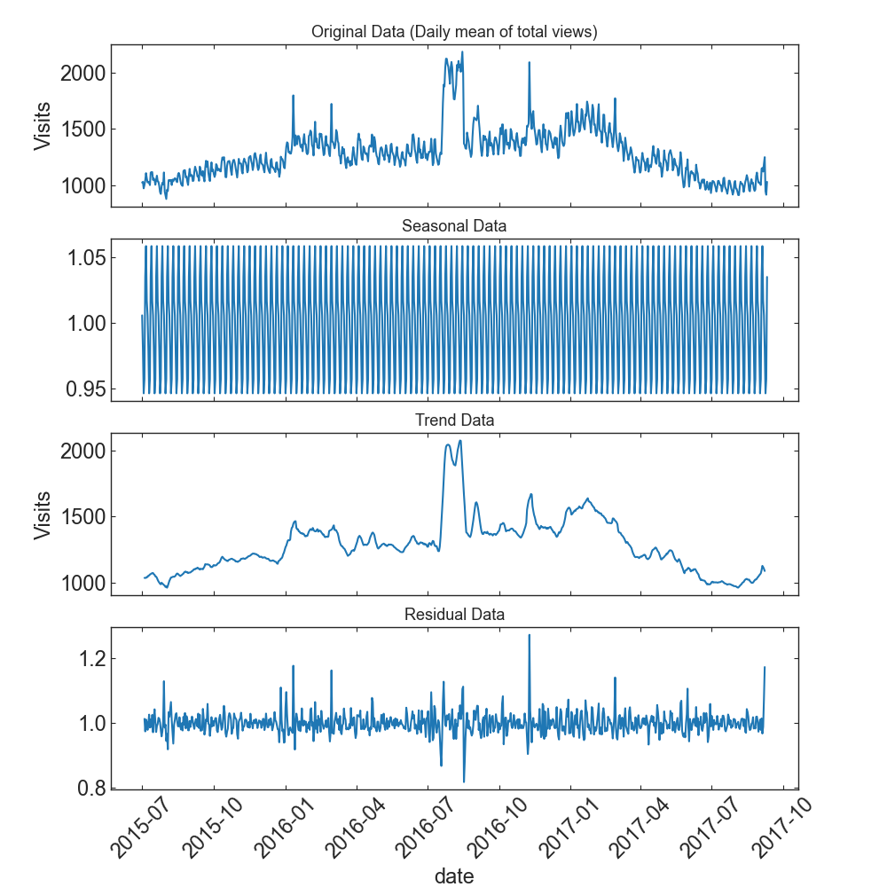
   
<i> Figure 7. The decomposed components of the averaged daily traffic time series dataset.</i>

Figure 7 shows the decomposed components of the averaged daily traffic time series data, which include
trend, seasonality, and residuals. As we see in the plot, the original time series data is not stationary, which
is required to yield an accurate SARIMA modeling result. Particularly, the data is reported to have a strong
seasonality.

In order to make the data stationary, we conduct ***Augmented Dickey-Fuller (ADF)*** test, which is a
fundamental significance test. We found that the original data is not likely stationary. The differenced time
series with one-day shifted data satisfies the stationary test criteria, but we find that the dataset with
differenced logarithmic transformation is the most stationary, which we employ.

   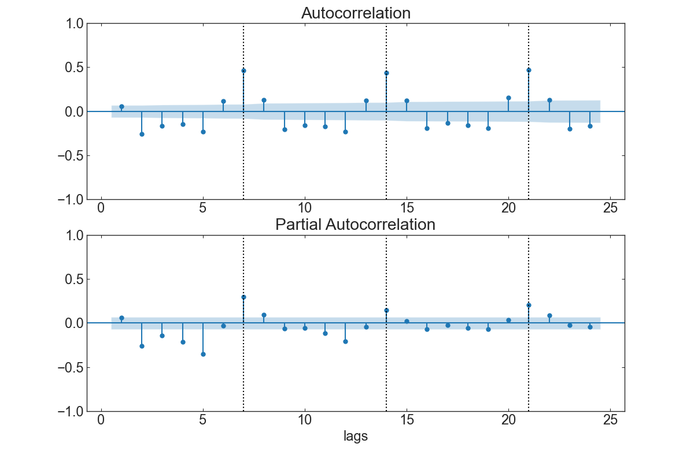
   
<i>Figure 8. Autocorrelation and Partial Autocorrelation function plots from the average daily traffic time series data.</i>

Stationarity means that the time series does not have a trend, has a constant variance, a constant
autocorrelation pattern, and no seasonal pattern. In order to check stationarity in depth for the transformed
time series data, we scrutinize the plots for ***autocorrelation function (ACF)*** and ***partial autocorrelation
function (PACF)***. The ACF drops rapidly if the data is stationary. In Figure 8, we can see that there is strong
weekly seasonality in the data. Therefore, we build SARIMA model with the seasonal period of m=7 and
perform hyper-parameter tuning for other configurations.

   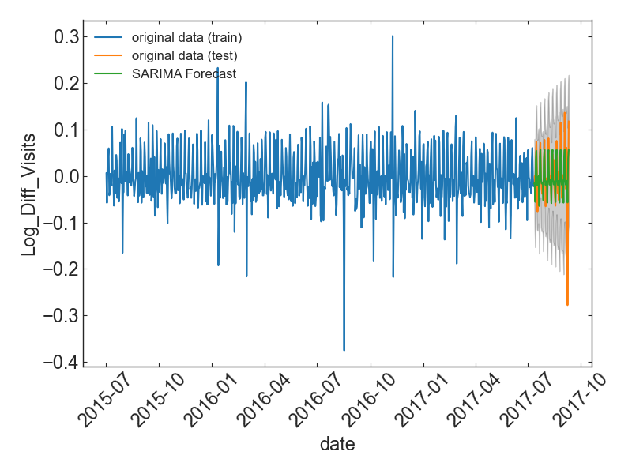
   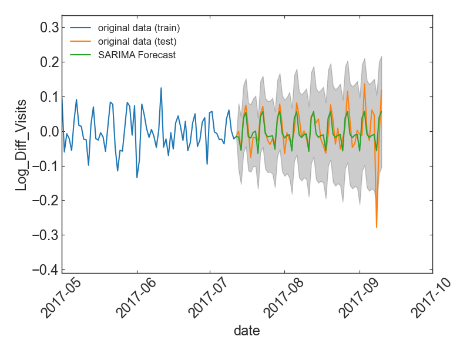  
   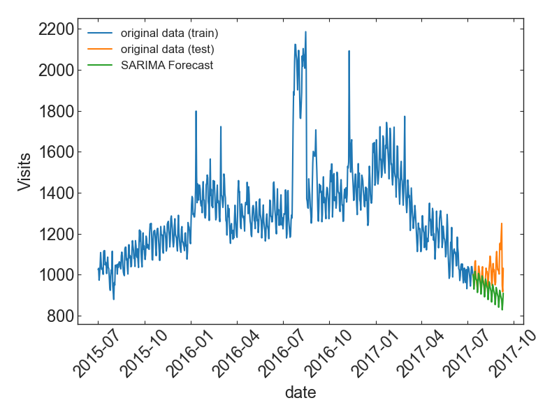
   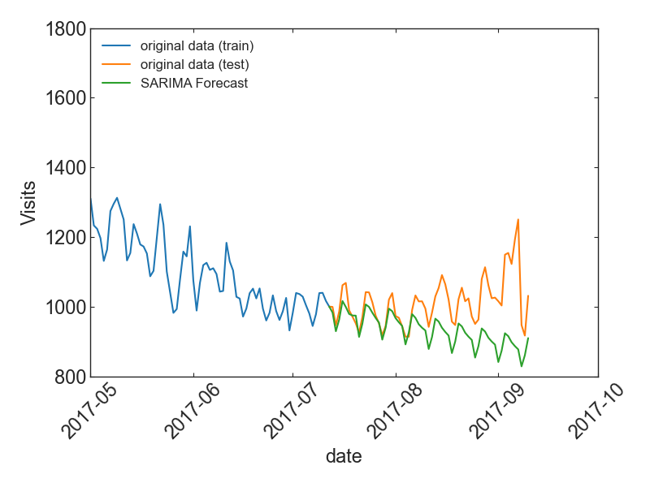
   
 <i>Figure 9. The prediction of the average daily view, or visits. The predicted value is green line, and the actual values are blue (train) and orange (test) lines. Upper panels show the time series data for which logarithmic transformation and differencing are applied. Down panels show the recovered time series back to actual values. Left panels show the entire time range and right panels show the zoomed time range where we can compare the predicted value with the actual one in detail.</i>
   


Figure 9 shows the results of SARIMA model. The upper panels show the logarithmic and differenced
data. As we see in the right panel, the predicted values (green line) are well consistent with the actual values
(orange line). The gray shade represents the 95% confidence interval. The bottom panels show the data,
and we recover the format back to the actual one.

### Prophet by Facebook

[Prophet](https://facebook.github.io/prophet/) is an open-source software for forecasting time series data, which was developed and maintained
by Facebook’s Core Data Science team. It is known that Prophet works best with time series that have
strong seasonality, which our data apparently possesses.

By default, Prophet automatically detects abrupt changes in the trajectories of time series data. We adopt
the default configuration of Prophet and perform the modeling. The result is shown in Figure 10. The overall
prediction over all period is well consistent with the actual data, however, there is a bump at the forecasted
data after July 2019 , which is not expected.

   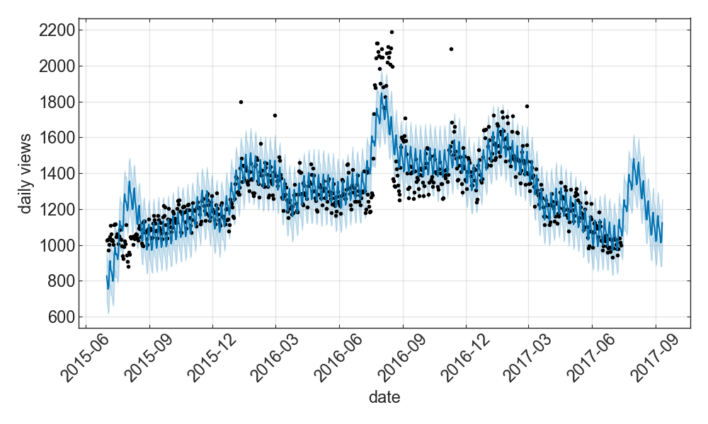
   
<i>Figure 10. Prediction of the average daily view from Prophet model. The blue solid line represents
the prediction, the blue shade represents 95% confidence level, and the black dots represent the
actual value (only train data).</i>

### Long Short-Term Memory (LSTM)

LSTM is an artificial neural network, which has feedback connections by a recurrent neural network (RNN)
that processes not only single data points but also entire sequences of data. The key idea of LSTM
architecture is to provide a short-term memory for RNN that can last numerous timesteps, thus 'long shortterm
memory'.

Unlike the previous models, the neural network is trained as a supervised model, and it requires a specific
form of train data that has a structure including look-back time. Look-back is the number of previous days'
data to predict the value for the next day. As a fiducial setup, we set the look-back time to 10 days. The
result is shown in Figure 11. It is apparently the best match among all models in this analysis.

   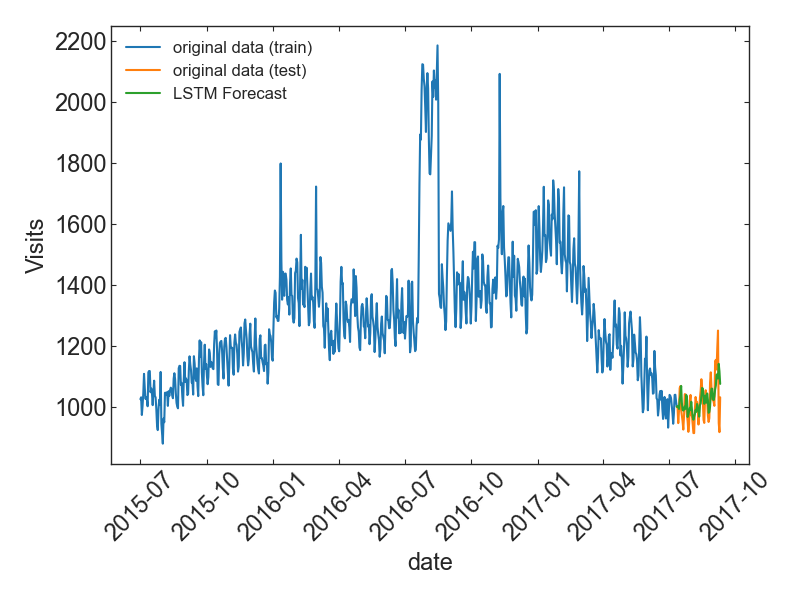
   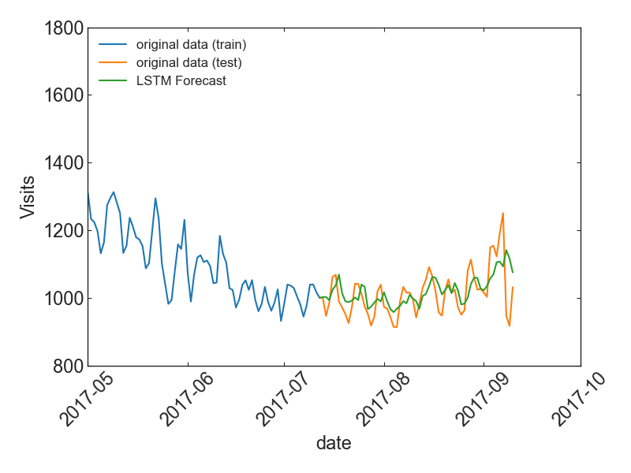
   
 <i>Figure 11. Prediction of the average daily view from LSTM model. The blue and orange line represent the actual data, which split into train and test, respectively. The green line represents the predicted value. The left panel shows the result in the entire time period, and the right panel shows the result in zoomed period, where we can check the predicted value in detail.</i>
   

### Comparison of the predictions from the different models

In Figure 12, we can compare the predictions from the different models for the last 60 days in the time
series data. Among all models, we find that LSTM forecast is the best match (see the blue and red lines).
Interestingly, Prophet's forecasting result has some bump in August 2017, which deviated from the actual
values. We may need to adjust some parameters to improve the Prophet model, such as seasonality,
changepoint, and holidays.

   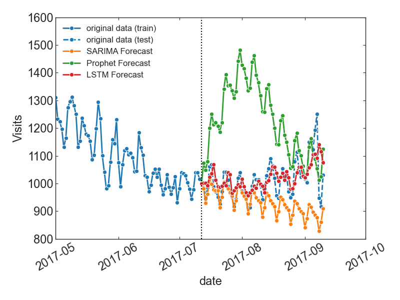
   
<i>Figure 12. The predicted average daily view for 3 different models: orange, green, red lines
represent SARIMA, Prophet and LSTM forecast results, respectively. Blue line is actual data.</i>

In order to quantify the model performance, we measure symmetric Mean Absolute Percentage Error
(sMAPE), which is a scale-independent regression metric that expresses the relative error of a set of
predictions and their actual values as a percentage. Figure 13 shows the sMAPE scores for 3 different
models and we can see that LSTM prediction has a 4.2% error, which is the smallest, implying that it is
indeed the best model.

   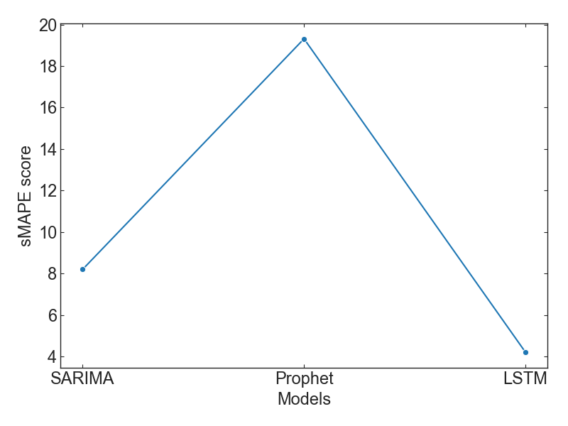
   
<i>Figure 13. sMAPE scores for 3 models.</i>

## Further Suggestion

In this analysis, we reduced the time series data for 145k wiki pages to the total daily average view.
Although we decided to use the reduced data, this would sacrifice lots of information inevitably. In our
analysis, we could forecast the overall trend of daily view, but we may need to be careful as the influence
of the individual pages is not taken into account, but the collective effects. We may investigate models by
using the sub-group of the time series data, such as grouped by languages.

## Conclusion

In this work, given the time series data that contains 145k Wikipedia pages, we build and evaluate three
different models: SARMIA, Prophet, and LSTM. We find that there is strong weakly seasonality in the
daily average traffic over the period. We make use of the sMAPE score to evaluate the models and find that
the LSTM model provides the best prediction on this time series data. Our analysis can be extended by
modeling the sub-groups to consider the effects of the features in the wiki pages such as language, access,
and agent.