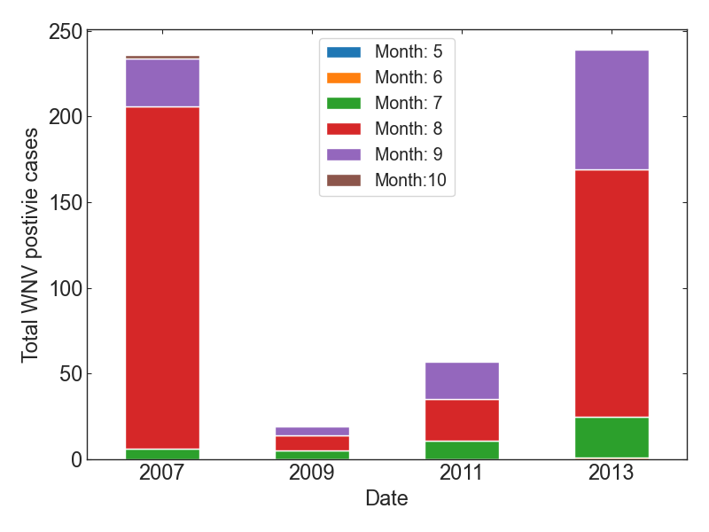

# Capstone: West Nile Virus

<!--
## Data is obtained from Kaggle competition: 
[West Nile Virus Competition](https://www.kaggle.com/competitions/predict-west-nile-virus/overview)

## Project Description:
-->

## Problem Identification Overview

How can the City of Chicago predict an outbreak of West Nile Virus, which is known to be spread through infected mosquitos, using weather conditions, and thus mitigate its spread next year effectively by controlling the number of mosquitos with spray?

### Context

West Nile virus (WNV) is widely spread to humans through infected mosquitos and its symptoms are
ranged from a persistent fever to serious neurological illnesses. The primary goal is to build a model that predicts outbreaks of West Nile virus in mosquitos using the given environmental conditions, such as weather, season, and location. The data has been established by the City of Chicago and the Chicago Department of Public Health (CDPH) for the period between 2007 and 2013, including the test results of the virus in trapped mosquitos.

## Recommendation

Given the weather information, we build a model that predicts the presence of WNV accurately. We
evaluate 5 different algorithms with hyper-parameter tuning. Among these algorithms, we find that the
Random Forest model is the best one for this project. The outcome of the analysis reveals that wet and
warm air can increase the number of mosquitos and thus spread WNV widely. We suggest for the City of
Chicago and CDPH to use our Random Forest model to make a decision effectively when they apply the
spray to reduce the number of mosquitos, given the measured weather condition. We also note that the virus
actively prevailed on August from the record between 2007 and 2013. Therefore, it demands that the efforts
on tracking the presence of virus across the city should be taken carefully during the summer.

## Data Analysis

### Data
Data is obtained from [Kaggle competition for West Nile Virus prediction](https://www.kaggle.com/competitions/predict-west-nile-virus/overview)

- Main Data
	- WNV test results and the number of trapped mosquitos that were measured in Chicago between
2007 and 2013
- Spray Data
	- Date and location for spray efforts to kill mosquitos
- Weather Data
	- Dataset from NOAA of the weather condition from 2007 to 2014

	
### Spread of mosquitos and WNV presence along with spraying information

In 2002, the first human cases of WNV were reported in Chicago. Due to its high infection rate and fatality,
the city of Chicago and the Chicago Department of Public Health (CDPH) has established a comprehensive
surveillance and control program by 2004.

Through the program, mosquitos are trapped across the city every week from late spring to the fall and
tested for the virus. The results of these tests help determine the strategic treatment as to when and where
the city will spray airborne pesticides to control adult mosquito populations.

   
   
<i>Figure 1. The cumulative number of trapped mosquitos and the presence of WNV between 2007 and 2013. The pink shade indicates the location where spraying was conducted to control the mosquitos.</i>

Figure 1. shows WNV outbreaks and the cumulative number of trapped mosquitos between 2007 and
2013. It is apparent that mosquitos are broadly distributed across the entire city of Chicago, and the presence
of WNV is naively proportion to the number of mosquitos: the largest WNV-positive case (red circle; > 60)
is found where the collective number of mosquitos is larger than 20,000.

In order to reduce the number of mosquitos, the City of Chicago has applied a spray across the city. The
locations of the spray were overlaid as pink circles in Figure 1. We can see that the spray is considerably
effective to control the mosquito population, and thus minimize the spread of WNV.

### Species of Mosquitos

There are 6 species in the trapped mosquitos: Culex Erraticus, Culex Pipens, Culex Restuans, Culex
Salinarius, Culex Tarsalis, and Culex Territans. Figure 2 shows that Culex Pipens is the most trapped one
in the species. Interestingly, WNV is transferred only by the specific species: Culex Pipens and Culex
Restuans. The number count of WNV from other species is zero. Explaining the medical connection
between the virus and species of mosquito is beyond the scope of this report. However, it would be notable
to identify the dominant species that potentially carry the virus, as it can help select the specific insecticide
spray to effectively reduce the target mosquitos.

   
   
   
<i>Figure 2. The number of trapped mosquitos (left panel) and the WNV-positive cases (right panel) depending on the species of mosquitos</i>

### WNV-Positive Cases by date

Figure 3. shows the total number of WNV-positive cases, which were grouped by year and month. We can
see that WNV is significantly active in 2007 and 2013, while is inactive in 2009 and 2011. The goal of
this project is to understand how the spread of WNV is affected by the weather condition, so that we can
help the City of Chicago plan the strategy of spraying effectively. Another interesting trend is that the total
count of WNV positive case is dominant in August. We will check if high temperature or wet air during the
summer influence the spread of the virus.

   
   
<i>Figure 3. The stacked bar chart for WNV-positive cases, which were grouped by year and month</i>

### A detailed description of the Weather Dataset

In this analysis, weather conditions are measured from two stations, which were located near the City of
Chicago: station 1 is near Chicago O’hare International Airport and station 2 is near Chicago Midway
International Airport. It contains local climatological data between 2007 and 2015: daily
maximum/minimum temperature, average temperature, a departure from normal, dew point, wet bulb,
heating, cooling, sunrise, sunset, weather type, snow, daily total precipitation, pressure, wind speed, and
wind direction.

As seen in Figure 4, the most of features have seasonal characteristics, where some patterns are repeated
yearly. For example, it is obvious that the average temperature is highest for July to August and lowest in
November. Note that the weather was measured between April and November every year. In Figure 3, blue
and orange colors represent the weather condition measured from station 1 and station 2, respectively. It
shows that both data are highly consistent with each other as the stations are located closely. In order to
minimize complexity, we make use of the weather data only from station 1.

There are some missing values in the weather dataset. For the missing values in the average temperature (Tavg), we
replace the values with the mean of maximum and minimum temperature (Tmin + Tmax)/2. The missing values in the
rest features are filled with the forward method, as the features are continuous.

   
   
<i>Figure 4. Weather conditions, which is observed from Station 1 and Station 2 between 2007 and 2015</i>

Figure 5. shows the average temperature between 2007 and 2014. In general, the temperature lies within 65 ~ 70
degrees Fahrenheit, while the lowest average temperature was observed in 2009. It is expected that temperature would
be of importance as it affects the condition of the population of mosquitos, which potentially carry WNV.

   
   
<i>Figure 5. Box plot for the average temperature between 2007 and 2014</i>

### Average temperature vs. Mosquitos / WNV

It is expected that the number of mosquitos and WNV cases are affected by the weather condition. Before
establishing machine learning models, we take look at the relationship by displaying the data.

Figure 6 shows the correlation between the average temperature and the number of mosquitos and WNV
presence. It is apparent that mosquitos and WNV are more prevalent in higher temperature: the number of
mosquitos increases up to 6000 and the number of WNV cases increases up to 40 when the average
temperature is higher than 70 degrees in Fahrenheit. Below the temperature, the number of mosquitos is
smaller than 1000, and thus no significant spread of WNV.

   
   
<i>Figure 6. Correlation between the average temperature and the number of mosquitos
& WMV presence.</i>

The annual presence of WNV-positive cases is affected by the average temperature. The box plots in Figure
7 show that the average temperature is generally higher in 2007 and 2013 when WNV is actively detected
(see the orange boxes where WNV is positive).

   
   
   
<i>Figure 7. The average temperature along with WNV presence between 2007 and 2013</i>

## Data Engineering

In order to prepare the dataset for building a model, we scrutinize the data in depth and select the feature of
interest. Firstly, we change the data format for the categorical features (Species and CodeSum) by label
encoder. Since the machine learning model cannot handle non-numeric variables, we convert the categorical
values to corresponding numbers. Secondly, we note that the weather can give an impact on the condition
for the proliferation of mosquitos and thus the spread of WNV in a certain period. Therefore, we add
features that contain weather data, which is shifted to 1, 3, and 7 days before (denoted to “_1, _3, _7”).

In this project, WNV presence, the target variable, is highly imbalanced. The positive case is only 5% of
observations. Since such a high imbalance severely hampers building an accurate model, we adjust the
dataset by under-sampling the majority case (here the negative WNV). Handling imbalance can be further
improved and tested with other techniques, such as the Synthetic Minority Oversampling Technique
(SMOTE), but we merely make use of under-sampling in this analysis.

We reduce the feature size by eliminating not-interested features. The importance of features is evaluated
with [Weight of Evidence (WoE) and Information Value (IV)](https://github.com/pankajkalania/IV-WOE) . Based on the suggested criteria (not important when IV < 0.02), we explore the dataset and re-iterate the criteria values. In this analysis, we eliminate features where their IV values are smaller than 0.01, and the data size is reduced from 68 to 47. 

The features that are strongly correlated to other features can make it difficult in distinguishing between
their individual effects on the dependent variable, the presence of WNV in this analysis. To reduce multicollinearity, we evaluate the [Variance Inflation Factor (VIF)](https://www.geeksforgeeks.org/detecting-multicollinearity-with-vifpython/), which picks each feature and regresses it
against all of the other features. By definition, VIF values are related to R-squared values, so higher VIF
values indicate a higher correlation. It is well accepted that a VIF value above 5 denotes the feature in a
high multi-collinearity. Using this process, we remove all features that are highly correlated against the
other features, and the number of the features is reduced to 11.

The correlation between features in the final dataset that is ready for modeling is depicted in Figure 8. As
seen in the Figure, the selected features are relatively independent of each other.

   
   
<i>Figure 8. Correlation map between features after removing features that are highly correlated to the other features.</i>

## Modeling

Using the cleaned & reduced dataset, we build up a model with 5 different methods: Logistic regression,
Random Forest, Gaussian Bayes, Support Vector Machine (SVM), and K-Nearest Neighbors. For each
method, we perform hyper-parameter tuning with randomized search cross-validation to optimize each
model.

After finding the optimized setups, we compare the best models by using the ***Area Under Curve (AUC)***
value for the ***Receiver Operating Characteristics (ROC) curve***, which is the probability curve between the
false positive rate and the true positive rate. In this benchmark, we find that in this analysis, the Random
Forest model covers most areas among the models (see Figure 9). In Figure 10, it is clear that the AUC
score is highest in the Random Forest model, whose value is 0.84. More robust models, such as Logistic
Regression and Gaussian Bayes, have significantly low scores as expected.

   
   
<i>Figure 9. Comparison of receiver operating characteristic curve for the different models.</i>

   
   
<i>Figure 10. The comparison of best Area Under Curve scores for the different models.</i>

Figure 11 shows the confusion matrix for the Random Forest model, which is the best one among the
model we test. As seen in the figure, the precision (True Positive / (True Positive + False Positive)) is 0.75
and the recall (True Positive / (True Positive + False Negative)) is 0.81. Since this analysis aims to predict
the presence of the virus, reducing a false negative result is relatively more important than reducing a false
positive. Therefore, we are focusing on the recall value carefully in this problem. Along with the high value
of the AUC score, the Random Forest model yields a recall value of 0.81, which is higher than that of any
other models.

   
   
<i>Figure 11. Confusion matrix for Random Forest Model</i>

## Importance of Features

In order to understand what are the main features that affect the output of our model, we make use of the
[Shapley Additive exPlanations (SHAP) method](https://towardsdatascience.com/using-shap-values-to-explain-how-your-machine-learningmodel-
works-732b3f40e137), which discloses the individual contribution of each feature to the output of the model.

Figure 12 shows a bar plot and a violin plot, which describe the relative importance of the individual
feature. The top two key features are the wind direction 3 days before the observation (ResultDir_3d) and
the total precipitation 1 day before the observation (PrecipTotal_1d). In the violin plot, we can see that the
wind that blows from a high angle (see the red color) results in producing strong positive SHAP values.
This is likely because the wind from a certain direction helps mosquitos being proliferated. The wind may
contain some ingredients that favor the environment for mosquito incubation, such as wet and warm air.
Similarly, the total precipitation can increase humidity in the air, and thus help a mosquito-favored
environment. Interestingly, heating is the least important feature as we see in Figure 12. This implies that
heating has almost no contribution to the prediction of WNV presence.

   
   
   
<i>Figure 11. Confusion matrix for Random Forest Model</i>

## Further Suggestion

In this analysis, we have a caveat that the effect of spray at some locations is already considered in the
dataset. Therefore, it may cause some deviation from the output of the model, in which the number of
mosquitos is not controlled by humans but is merely affected by nature. As we can see in Figure 1, the
effect of spray is not trivial: the spray can reduce the number of mosquitos significantly. To build a model
that predicts the presence of WNV by the weather condition (not by humans), we may separate the dataset
between sprayed and non-sprayed regions and use a non-contaminated one. This also helps evaluate the
effect of the spray in depth.

## Conclusion

In this work, given the weather information, we build a model that predicts the presence of WNV in the
City of Chicago. As a preprocess, we

- impute the missing data by checking the characteristics of features,
- mitigate the imbalanced dataset by undersampling of majority case (WNV negative case),
- eliminate the less important features using the Weight of Evidence and Information Value technique,
- eliminate the features with a high degree of multi-collinearity using the Variation Information Factor
method.

With the cleaned dataset, we benchmark 5 different models: Linear Regression, Random Forest, Gaussian
Naïve Bayes, Support Vector Machine, and K-Nearest Neighbors. We perform a hyper-parameter tuning
for each model and find that Random Forest is the best one among the models, which is judged by the AUC
score and the retail value.

Finally, we evaluate the features that give a strong contribution to the prediction by using the SHAP
method. The top two key features are the wind direction 3 days before the observation (*ResultDir_3d*) and
the total precipitation 1 day before the observation (*PrecipTotal_1d*). These features have a high positive
contribution when their values are high.
