# User Adoption Challenge

## Problem Identification Overview

Companies invest huge amount of money and efforts in technologies, but this would not be profitable if users are not using the tech. The biggest barrier to user adoption is keeping users being attracted to the developed tools that the company has provided.

In this project, I analyzed the pattern of data regarding to the adoption rate, and built a model to predict the adoption rate from user's information.

## Data Inspection

- **takehome_users**
	- name: the user's name
	- object_id: the user's id
	- email: email address
	- creation_source: how their account was created. This takes on one of 5 values:
		- PERSONAL_PROJECTS: invited to join another user' personal workspace
		- GUEST_INVITE: invited to an organization as a guest (limited permissions)
		- ORG_INVITE: invited to an organization (as a full member)
		- SIGNUP: signed up via the website
		- SIGNUP_GOOGLE_AUTH: signed up using Google Authentication (using a Google email account for their login id)
	- creation_time: when they created their account
	- last_session_creation_time: unix timestamp of last login
	- opted_in_to_mailing_list: whether they have opted into receiving marketing emails
	- enabled_for_marketing_drip: whether they are on the regular marketing email drip
	- org_id: the organization (group of users) they belong to
	- invited_by_user_id: which user invited them to join (if applicable).

- **takehome\_user\_engagement**
	- time_stamp
	- user_id
	- visited

## Exploratory Data Analysis

   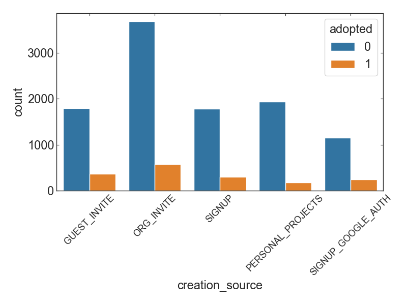
   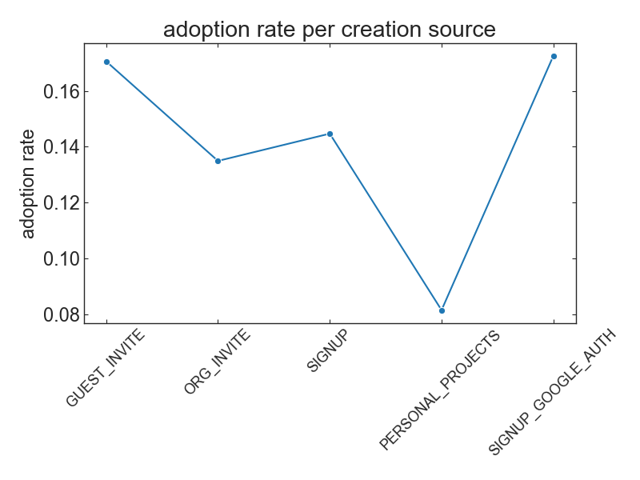
   
 <i> Figure 1. Nmber count (left) and adoption rate (right) for the ways that users signed up. </i> 
   

- Users were signed up moslty as a full member of an orgianization. However, the number of non-adopted users is also large for this case.
- The adoption rate is the highest when users are invited to an orgizniation a a guest, and the lowest when users are invited to join another user's personal workspace.
- Users who sign up using Google Authentication are very likely adopted.

   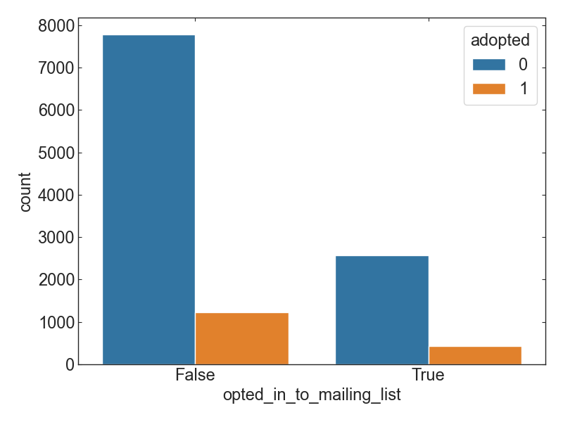
   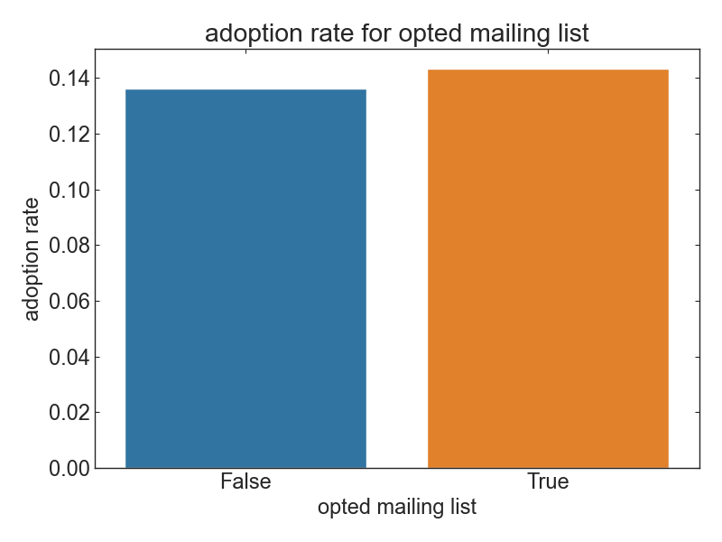
   
 <i> Figure 2. Nmber count (left) and adoption rate (right) for the choices whether they have opted into receiving marketing emails </i> 
   

- The adoption rate is slightly increased when the users have opted into receiving marketing emails.

   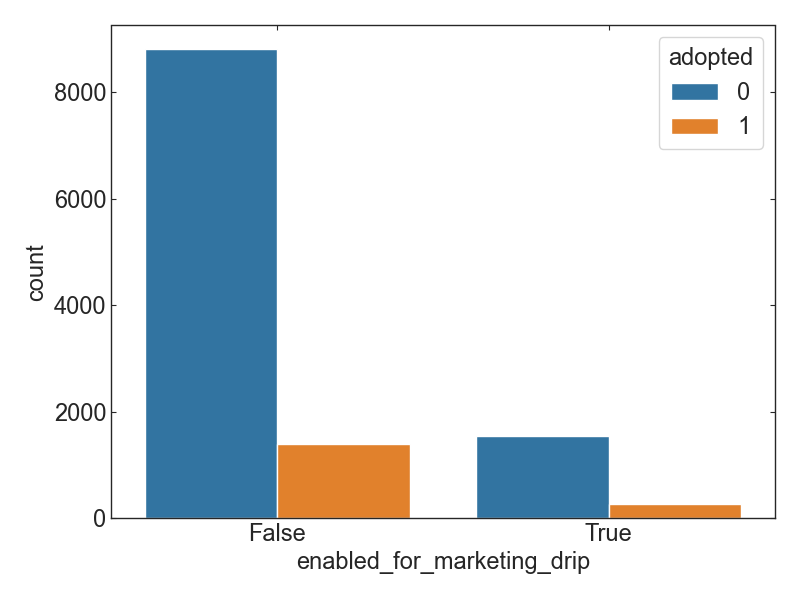
   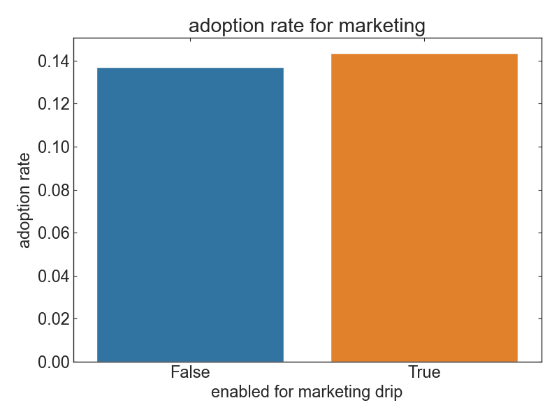
   
 <i> Figure 3. Nmber count (left) and adoption rate (right) for the choices whether they are on the regular marketing email drip </i> 
   

- The adoption rate is slightly increased when the users are on the regular markketing email drip.

## Feature Engineering
- The data is highly imbalanced. The adoption rate is only 13%.
	- Imbalanced data is resampled via SMOTE method.
- Categorical features are transformed by one-hot code transformation.
- add addtional features of interest:
	- `active_time`: time period that users are active
	- `account_time`: time period since users signed up
- eliminate features that are highly correlated to other feature

   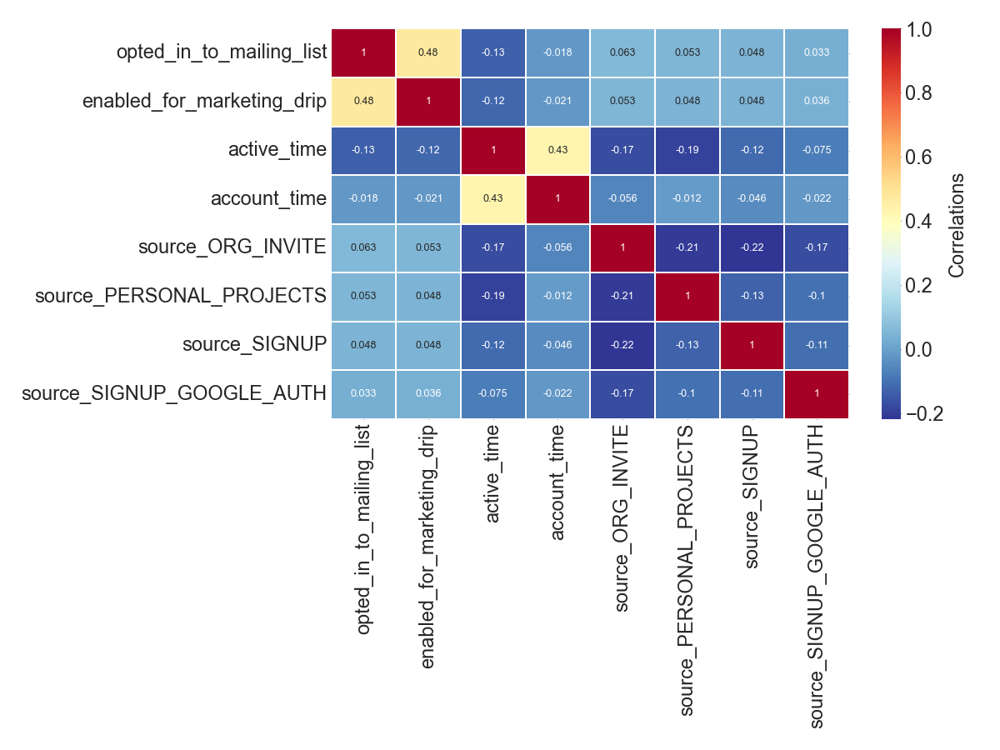
   
 <i> Figure 4. Heatmap of features that presents correlation of features to others </i> 
   

## Modeling
- make use of a Random Forest model
- conduct hyper-parameter tuning

   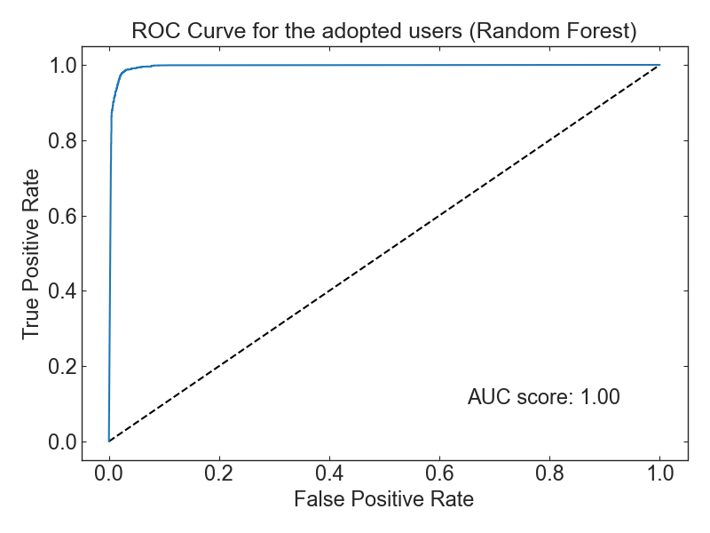
   
 <i> Figure 5. Receiver Operating Characteristic curve for the adopted users </i> 
   

- The model performance is extraordinary. 

   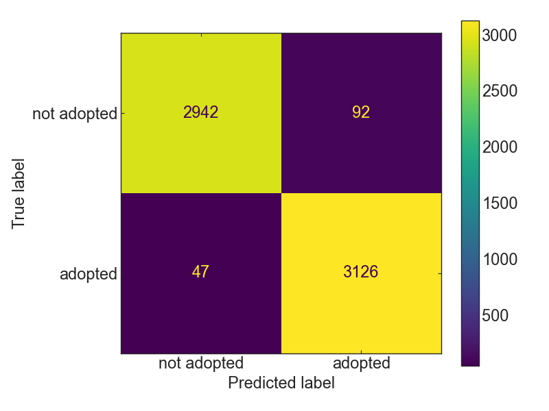
   
 <i> Figure 6. Confusion Matrix for the predicted adopted users </i> 
   

## Interpretation of results

   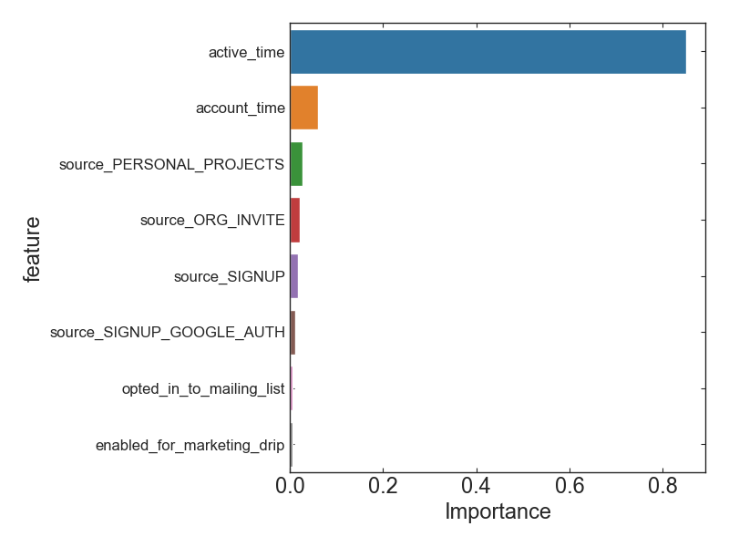
   
 <i> Figure 7. Feature Importance that is computed by permutation feature importance </i> 
   

- active time is the most critical feature to evaluate the adoption of users.

### SHAP Analysis

   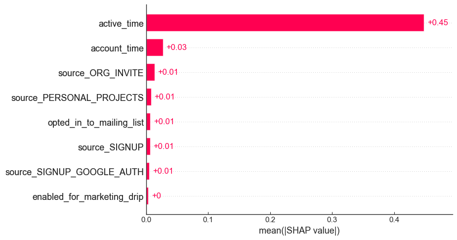
   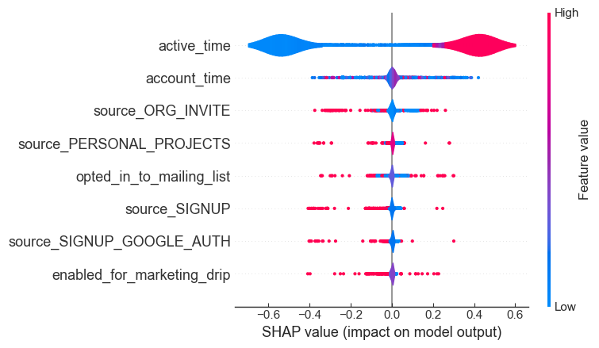
   
 <i> Figure 8. Feature Importance that is computed by SHAP analysis: bar chart(left) and violin chart(right) </i> 
   

It is obvious that

- active time is ciritical to evaluate the adoption of users.
- account time is also of importance.

I recommend that to increase the number of adopted users, the organization needs to encourage existing users to log in and try using programs even though they opened the account for a while ago.
